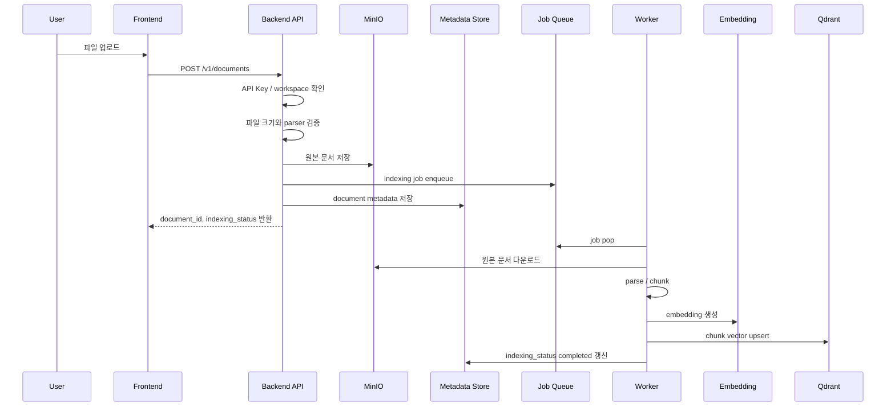
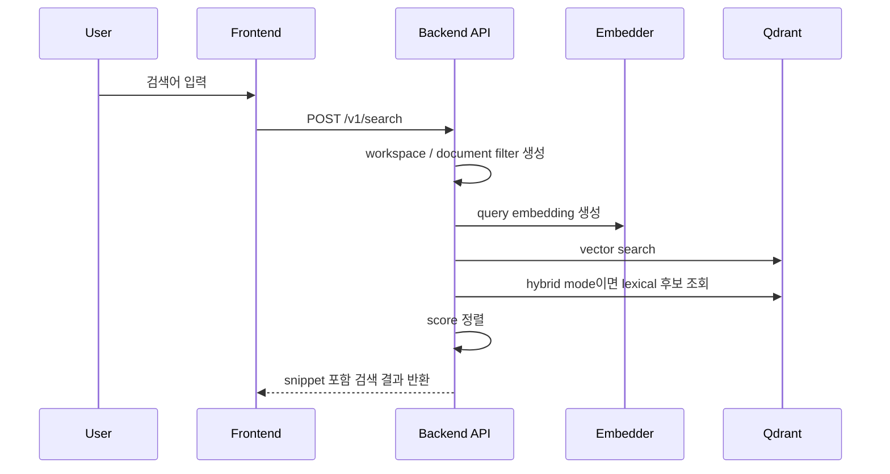
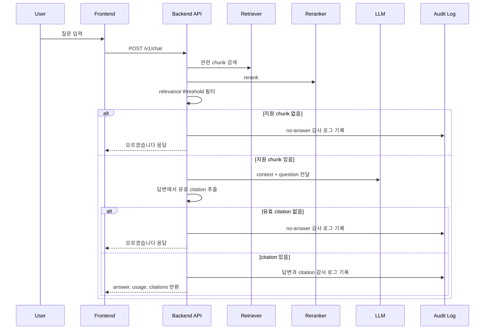
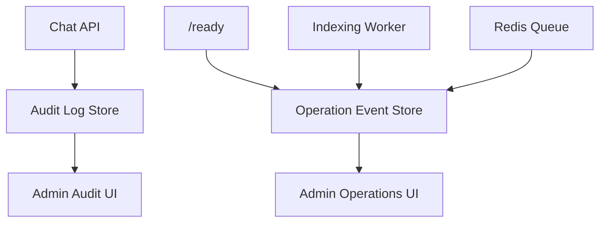

# Agent Flow 문서

이 문서는 DocSearch AI V2 MVP의 주요 처리 흐름을 기능별로 분리해 설명합니다. 여기서 Agent Flow는 LLM agent framework가 아니라, 문서 처리와 RAG 답변을 구성하는 서비스 흐름을 의미합니다.

## 문서 업로드와 인덱싱

### 예외 처리

| 상황 | 처리 |
| --- | --- |
| 지원하지 않는 확장자 | `DOCUMENT_UNSUPPORTED_TYPE` |
| 빈 문서 | `DOCUMENT_EMPTY` |
| 깨진 TXT/PDF/DOCX | `DOCUMENT_CORRUPT` |
| 대용량 문서 | `DOCUMENT_TOO_LARGE`, HTTP 413 |
| Redis enqueue 실패 | 문서 상태 `failed`, 운영 이벤트 `indexing.queue_unavailable` |
| worker 처리 실패 | 재시도 가능하면 `queued`, 한도 초과 시 `failed` |

## 검색 흐름

### 검색 정책

| 모드 | 동작 |
| --- | --- |
| `dense` | query embedding으로 Qdrant vector search 수행 |
| `hybrid` | dense 후보와 lexical 후보를 합친 뒤 dense/lexical 가중합으로 정렬 |
| document filter | 요청 document_ids가 있으면 같은 workspace 안의 해당 문서로 제한 |

## 채팅 RAG 흐름

### Grounding 정책

| 단계 | 정책 |
| --- | --- |
| retrieval 결과 없음 | LLM 호출 없이 no-answer |
| rerank relevance 부족 | LLM 호출 없이 no-answer |
| LLM 답변 citation 없음 | no-answer |
| LLM 답변 범위 밖 citation만 있음 | no-answer |
| LLM 답변 citation 중복 | 첫 citation만 유지 |
| 응답 citations | 답변 본문에 실제 표시된 `[n]`만 반환 |

## 감사 로그와 운영 이벤트

| 이벤트 | 발생 위치 | 확인 위치 |
| --- | --- | --- |
| `dependency.health_failed` | `/ready`, `/v1/admin/operations` dependency check | 관리자 운영 상태 |
| `indexing.queue_unavailable` | Redis enqueue 실패 | 관리자 운영 상태 |
| `indexing.retry_scheduled` | worker 실패 후 재시도 예약 | 관리자 운영 상태 |
| `indexing.failed` | worker 최종 실패 또는 in-process 실패 | 관리자 운영 상태 |
| chat audit event | 채팅 답변 생성 | 감사 로그 화면, CSV export |

## 로컬 노트북 검증 흐름

1. Notebook Compose로 AI stub 기반 전체 서비스를 실행합니다.
2. `local-dev-key`로 로그인합니다.
3. 작은 TXT 문서를 업로드합니다.
4. 문서 목록에서 `indexing_status=completed`를 확인합니다.
5. 검색 화면에서 문서 내용이 검색되는지 확인합니다.
6. 채팅 화면에서 답변, citation, 감사 로그가 생성되는지 확인합니다.
7. 운영 상태에서 dependency, model setting, indexing queue 상태를 확인합니다.

이 흐름은 기능 계약 검증용입니다. 실제 vLLM/BGE 품질과 latency는 별도 GPU 환경에서 측정합니다.
