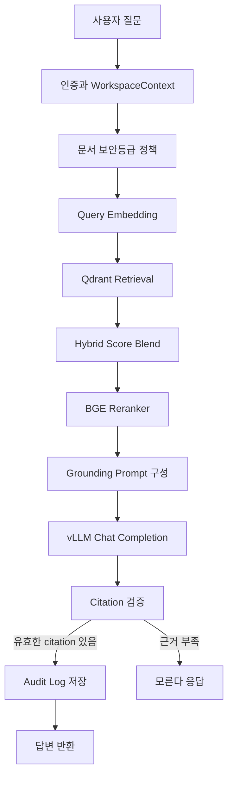
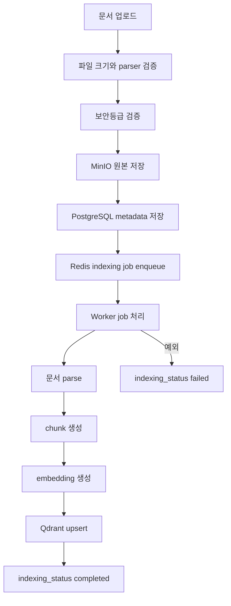
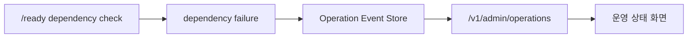

# Agent Flow

## 개요

DocSearch AI의 agent flow는 사용자의 질문을 직접 LLM에 전달하지 않고, 인증된 워크스페이스와 허용된 문서 보안등급 안에서 검색 근거를 만든 뒤 답변을 생성하는 흐름입니다. 이 문서는 포트폴리오 설명에서 RAG 파이프라인을 단계별로 보여주기 위한 기준 문서입니다.

## 전체 흐름

## 단계별 책임

| 단계 | 입력 | 처리 | 출력 |
| --- | --- | --- | --- |
| 인증 | Bearer token 또는 API Key | 사용자, workspace, role 확인 | `WorkspaceContext` |
| 보안등급 정책 | role, requested security levels | admin/member 접근 범위 적용 | 허용된 security filter |
| Query embedding | 질문 텍스트 | deterministic 또는 BGE-M3 compatible embedding | query vector |
| Retrieval | query vector, workspace/document/security filter | Qdrant dense search | 후보 chunk |
| Hybrid search | dense 후보, lexical 후보 | dense/lexical 가중 합산 | 정렬된 후보 chunk |
| Rerank | 질문, 후보 chunk | BGE reranker 또는 score preserving reranker | 최종 근거 chunk |
| Prompt 구성 | 질문, 최종 chunk | 허용된 문서 컨텍스트만 prompt에 포함 | LLM request |
| LLM 답변 | grounding prompt | vLLM/OpenAI compatible chat completion | 답변 초안 |
| Citation 검증 | 답변 초안, chunk 개수 | `[1]` 형식의 유효 citation 확인 | 답변 또는 모른다 응답 |
| 감사 로그 | 질문, 답변, citation, token usage | PostgreSQL 저장 | 감사 이벤트 |

## 문서 인덱싱 Flow

## 답변 생성 정책

| 정책 | 설명 |
| --- | --- |
| 허용 문서만 사용 | workspace, document_ids, security_levels filter를 통과한 chunk만 prompt에 포함 |
| 낮은 관련도 제외 | rerank score 또는 retrieval score가 기준보다 낮은 chunk는 제외 |
| citation 필수 | 답변에 유효한 `[n]` marker가 없으면 근거 부족으로 처리 |
| 근거 부족 응답 | 검색 결과가 없거나 citation이 없으면 `모르겠습니다. 제공된 문서에서 답변 근거를 찾지 못했습니다.` 반환 |
| 감사 로그 기록 | 성공 답변과 근거 부족 응답 모두 감사 로그로 남김 |

## 운영 이벤트 Flow

운영 이벤트는 dependency health 실패, indexing 실패, rate limit backend 장애 같은 운영 신호를 관리자 화면에서 확인하기 위한 경계입니다. 현재 MVP는 이벤트 저장과 조회 경계를 갖췄고, 이후 알림 채널 연동을 확장할 수 있습니다.

## 포트폴리오 설명 포인트

- LLM 호출 전 검색 필터와 보안 정책을 먼저 적용합니다.
- RAG 품질은 모델만이 아니라 chunk, retrieval, rerank, citation 검증이 함께 결정합니다.
- 실패한 인덱싱과 외부 의존성 장애를 화면에서 확인할 수 있게 운영 경계를 만들었습니다.
- 감사 로그를 통해 누가 어떤 문서 근거로 어떤 질문을 했는지 추적할 수 있습니다.
