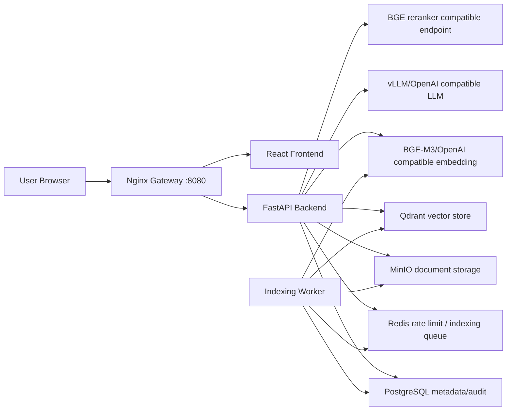

# 아키텍처 문서

DocSearch AI V2는 사내 문서를 업로드하고 로컬 또는 사내 GPU 환경의 OpenAI compatible 모델 서버와 연결해 검색, 채팅, 감사 로그, 운영 상태 확인을 제공하는 온프레미스 RAG 서비스입니다.

## 구성 목표

| 목표 | 구현 방향 |
| --- | --- |
| 온프레미스 실행 | Docker Compose 기준으로 API, worker, DB, Redis, Qdrant, MinIO, 모델 endpoint를 같은 경계 안에서 실행 |
| 모델 교체 가능성 | 백엔드는 OpenAI compatible LLM/embedding/reranker endpoint만 바라보고 모델 ID는 환경 변수로 분리 |
| 문서 처리 안정성 | 파일 타입별 parser, 빈 문서/깨진 파일/대용량 파일 오류 코드, chunking 경계 분리 |
| RAG 근거 신뢰성 | retrieval, rerank, citation filtering, no-answer guard를 채팅 서비스에 적용 |
| 운영 가시성 | `/ready`, `/v1/admin/operations`, 감사 로그, 운영 이벤트, 큐 backlog 표시 |
| 리뷰 가능한 개발 | 기능 단위 PR과 테스트 중심으로 `develop`에 누적 |

## 런타임 구성

## 서비스 책임

| 서비스 | 책임 | 주요 설정 |
| --- | --- | --- |
| `frontend` | 문서 업로드, 검색, 채팅, 감사 로그, 운영 상태 화면 | `VITE_API_BASE_URL` |
| `gateway` | `/api/*` backend proxy와 frontend proxy | `infra/nginx/default.conf` |
| `backend` | API 인증, 문서 메타데이터, 검색, 채팅, 감사 로그, 운영 상태 | `DOCSEARCH_API_KEYS`, `DATABASE_URL`, `QDRANT_URL`, `LLM_*` |
| `worker` | Redis 큐에서 인덱싱 작업 소비, parser/chunker/embedder/vector upsert 실행 | `INDEXING_QUEUE_*`, `EMBEDDING_*` |
| `postgres` | 문서 메타데이터와 감사 로그 영속화 | `DOCUMENT_METADATA_BACKEND=postgres`, `AUDIT_LOG_BACKEND=postgres` |
| `redis` | 분산 rate limit과 인덱싱 큐 | `RATE_LIMIT_BACKEND=redis`, `INDEXING_QUEUE_BACKEND=redis` |
| `qdrant` | chunk embedding vector 저장과 검색 | `QDRANT_COLLECTION`, `EMBEDDING_VECTOR_SIZE` |
| `minio` | 원본 문서 저장 | `MINIO_*` |
| `llm` | OpenAI compatible chat completion | `LLM_BASE_URL`, `LLM_MODEL` |
| `embedding` | OpenAI compatible embeddings | `EMBEDDING_BASE_URL`, `EMBEDDING_MODEL` |
| `reranker` | BGE rerank compatible endpoint | `RERANKER_BASE_URL`, `RERANKER_MODEL` |

## 데이터 저장 구조

| 데이터 | 저장소 | 내용 |
| --- | --- | --- |
| 원본 문서 | MinIO | 업로드 파일 원본 bytes |
| 문서 메타데이터 | PostgreSQL 또는 memory | 문서 ID, workspace, parser, indexing status, chunk count, error |
| chunk vector | Qdrant | workspace/document metadata와 embedding vector |
| 감사 로그 | PostgreSQL 또는 memory | 질문, 답변 preview, 토큰 사용량, citation 목록 |
| 운영 이벤트 | in-memory store | dependency failure, indexing failure, retry, queue unavailable |
| rate limit counter | memory 또는 Redis | API Key hash 또는 client IP 기준 요청 카운터 |
| indexing job | Redis list 또는 in-process | 문서 인덱싱 작업 payload |

## API 경계

| 영역 | 엔드포인트 | 권한 | 역할 |
| --- | --- | --- | --- |
| 상태 | `GET /health`, `GET /ready` | 공개 | 생존/준비 상태 점검 |
| 워크스페이스 | `GET /v1/workspace` | API Key | 현재 workspace와 role 확인 |
| 문서 | `POST/GET/DELETE /v1/documents`, `POST /v1/documents/{id}/reindex` | API Key | 업로드, 목록, 삭제, 재인덱싱 |
| 검색 | `POST /v1/search` | API Key | dense 또는 hybrid retrieval |
| 채팅 | `POST /v1/chat` | API Key | RAG 답변, citation, no-answer |
| 감사 로그 | `GET /v1/audit/chat`, `GET /v1/audit/chat/export.csv` | admin | 질문/답변 감사 로그 조회와 CSV export |
| 운영 | `GET /v1/admin/operations` | admin | readiness, dependency, runtime setting, queue 상태 |

## 인증과 운영 보호

- API Key 형식은 `api_key|workspace_id|workspace_name(|role)`입니다.
- role은 `member` 또는 `admin`입니다.
- 감사 로그와 운영 상태는 `admin`만 접근합니다.
- 운영 환경에서는 기본 개발 API Key를 사용하면 `/ready`가 `not_ready`를 반환합니다.
- `/v1/*` API에는 rate limit을 적용할 수 있고, Redis backend는 여러 API 인스턴스에서 카운터를 공유합니다.
- API Key 원문은 Redis rate limit key에 저장하지 않고 SHA-256 hash를 사용합니다.

## 로컬 실행 모드

| 모드 | 사용 상황 | 특징 |
| --- | --- | --- |
| 기본 Compose | 전체 경계 검증 | vLLM image를 포함하므로 GPU 없는 노트북에서는 막힐 수 있음 |
| Notebook Compose | Galaxy Book6 Pro 같은 로컬 노트북 기능 검증 | AI stub을 사용해 LLM/embedding compatible 계약을 빠르게 확인 |
| 외부 모델 endpoint | 로컬 GPU 또는 사내 GPU 서버 연결 | `host.docker.internal` 또는 사내 endpoint로 `LLM_BASE_URL`, `EMBEDDING_BASE_URL`, `RERANKER_BASE_URL` 지정 |

## 운영 확인 기준

- `/ready`에서 configuration과 활성 dependency check가 `ready`인지 확인합니다.
- `/v1/admin/operations`에서 backend, model, rate limit, indexing queue 설정이 의도와 같은지 확인합니다.
- 문서 업로드 후 `indexing_status`가 `completed`로 전환되고 `chunk_count`가 1 이상인지 확인합니다.
- 검색 결과가 같은 workspace/document filter 안에서만 반환되는지 확인합니다.
- 채팅 답변의 `[n]` citation과 응답 `citations`가 일치하는지 확인합니다.
- 근거가 없거나 유효 citation이 없으면 `모르겠습니다` 응답으로 전환되는지 확인합니다.
