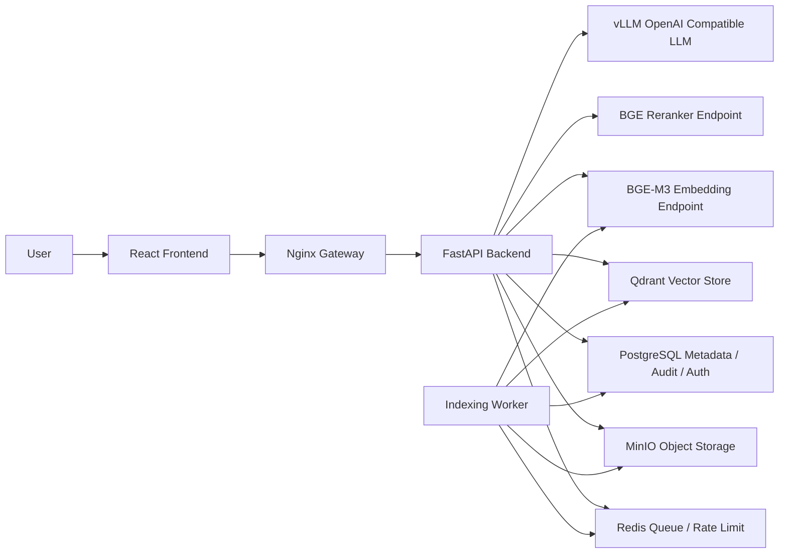
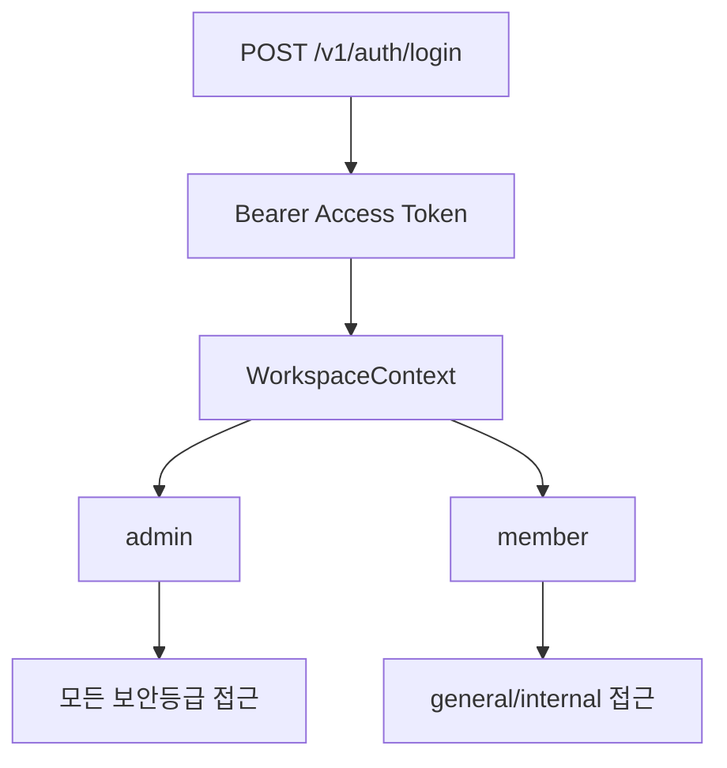
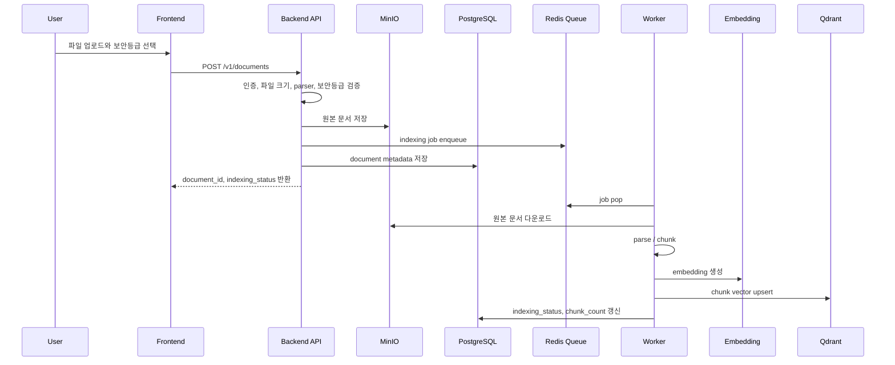
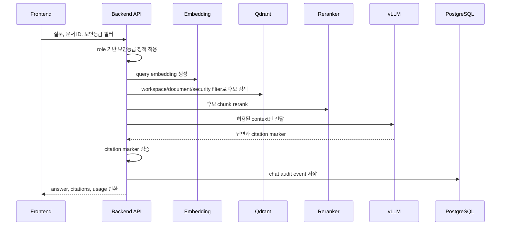

# DocSearch AI 아키텍처

## 목표

DocSearch AI는 사내 문서 검색과 질의응답을 온프레미스 환경에서 실행하는 RAG 서비스입니다. 핵심 목표는 문서 원본과 질문 데이터를 외부 API로 보내지 않고, 로컬 또는 사내망의 추론 서버와 저장소만 사용해 검색, 답변, 운영 상태 확인, 감사 로그를 제공하는 것입니다.

## 시스템 구성



## 주요 컴포넌트

| 컴포넌트 | 책임 |
| --- | --- |
| React Frontend | 로그인, 문서 업로드/검색/채팅, 운영 상태, 감사 로그 화면 |
| Nginx Gateway | `/api` reverse proxy, frontend 정적 자원 제공, 장시간 LLM 응답 timeout 조정 |
| FastAPI Backend | 인증, 문서, 검색, 채팅, 감사, 운영 API |
| Indexing Worker | Redis 큐에서 문서 인덱싱 작업을 pop하고 parsing/chunking/embedding/upsert 수행 |
| PostgreSQL | auth users, document metadata, chat audit events 저장 |
| Redis | indexing queue, retry state, rate limit counter |
| MinIO | 업로드된 원본 문서 저장 |
| Qdrant | chunk vector와 payload 저장, 검색 filter 적용 |
| Embedding Endpoint | OpenAI compatible embedding API |
| Reranker Endpoint | 검색 후보 chunk 재정렬 |
| vLLM | OpenAI compatible chat completions API |

## 인증과 권한



로컬 기본 관리자 계정은 `2301029 / password`입니다. API Key 인증은 자동화와 호환성을 위해 유지합니다. API Key role을 생략하면 `member`로 처리됩니다.

## 문서 업로드와 인덱싱



업로드 시점에는 문서 원본과 메타데이터를 먼저 저장하고, 인덱싱은 큐를 통해 비동기 처리합니다. 실패 시 실패 사유를 메타데이터에 저장해 문서 화면에서 확인할 수 있습니다.

## 검색과 채팅



LLM 답변에 유효한 citation marker가 없거나 검색 근거가 부족하면 서비스는 `모르겠습니다` 응답을 반환합니다. 이 정책은 포트폴리오에서 RAG 품질을 설명할 때 중요한 기준입니다.

## 운영 상태

운영 상태는 `/health`, `/ready`, `/v1/admin/operations`로 나뉩니다.

| 엔드포인트 | 목적 |
| --- | --- |
| `/health` | API 프로세스 생존 확인 |
| `/ready` | PostgreSQL, Qdrant, MinIO, vLLM, Redis 등 의존성 준비 상태 |
| `/v1/admin/operations` | 관리자 화면용 운영 상태, rate limit, LLM 설정, 이벤트 요약 |

## 데이터 저장 경계

| 데이터 | 저장 위치 |
| --- | --- |
| 사용자 계정 | PostgreSQL `auth_users` |
| 원본 문서 | MinIO |
| 문서 메타데이터 | PostgreSQL `document_metadata` |
| chunk vector | Qdrant collection |
| 채팅 감사 로그 | PostgreSQL `chat_audit_events` |
| 인덱싱 큐 | Redis |
| rate limit counter | Redis 또는 memory |

## 보안 경계

- 문서 보안등급은 업로드, 목록, 검색, 채팅, 삭제, 재인덱싱에 모두 적용됩니다.
- `member`는 `general`, `internal` 문서만 접근합니다.
- `admin`은 `confidential`, `restricted`까지 접근합니다.
- 운영 API와 감사 로그 화면은 관리자 역할에서만 접근합니다.
- readiness와 운영 응답은 DB URL, MinIO secret, LLM API key 같은 민감 값을 반환하지 않습니다.

## 로컬 실행 구성

기본 실행:

```bash
docker compose -f infra/compose/docker-compose.yml up --build
```

노트북용 AI stub 실행:

```bash
docker compose -f infra/compose/docker-compose.yml -f infra/compose/docker-compose.notebook.yml up --build
```

호스트 LLM 연결:

```bash
docker compose -f infra/compose/docker-compose.yml -f infra/compose/docker-compose.notebook.yml -f infra/compose/docker-compose.host-llm.yml up --build
```
