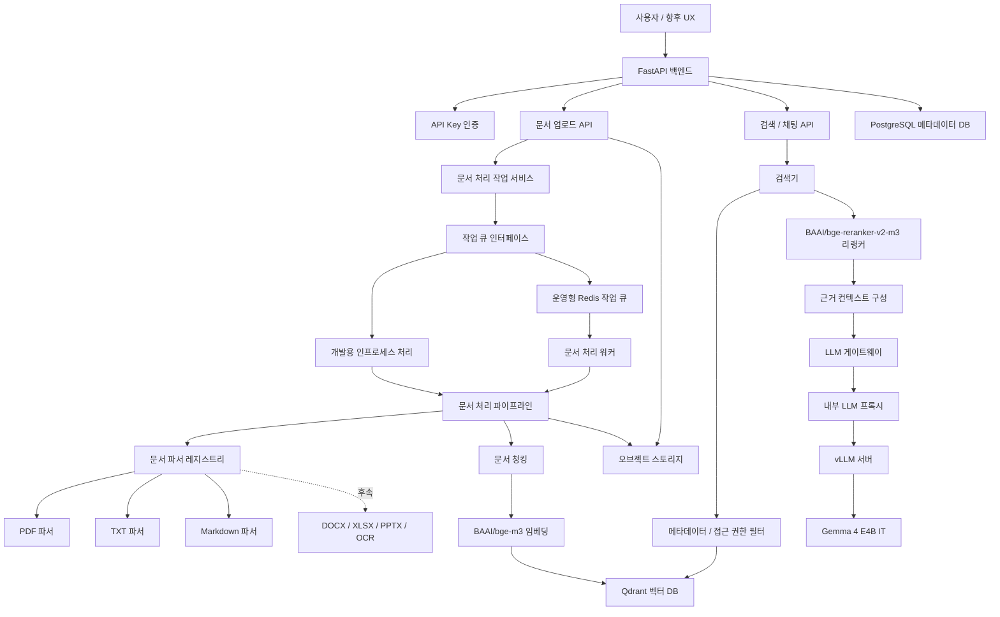

# DocSearch AI v2 설계 문서

- 작성일: 2026-04-21
- 상태: 설계 승인 초안
- 대상 브랜치: `v2-redesign`
- 포트폴리오 포지션: 백엔드/AI 엔지니어 중심, 인프라/운영 설계 보조

## 1. 배경

현재 `main` 브랜치는 v1 프로토타입으로 유지한다. v2는 기존 기획인 "로컬/온프레미스 문서 검색 RAG 시스템"을 유지하되, 포트폴리오에 맞게 설계, 커밋, 브랜치, 문서, 테스트 기록을 처음부터 다시 쌓는다.

v2의 목표는 단순 데모가 아니라 다음 역량을 보여주는 것이다.

- 문서 업로드부터 검색, 리랭킹, 답변 생성까지 이어지는 RAG 백엔드 설계
- LLM 서빙 계층을 애플리케이션과 분리하는 추상화
- 사용자 문서가 외부 API로 나가지 않는 로컬/온프레미스 추론 구조
- 비동기 문서 처리와 운영 가능한 작업 큐 설계
- 테스트, 검색 평가, 보안, 관측성을 고려한 백엔드 품질

## 2. MVP 범위

### 포함

- API Key 기반 인증
- 워크스페이스 단위 문서 접근 제어
- PDF, TXT, Markdown 문서 업로드
- 문서 원본 저장
- 문서 파싱, 텍스트 정규화, 청킹
- `BAAI/bge-m3` 기반 Dense 임베딩
- Qdrant 기반 Dense 벡터 검색
- 메타데이터와 접근 권한 필터링
- `BAAI/bge-reranker-v2-m3` 기반 리랭킹
- `google/gemma-4-E4B-it` 기반 답변 생성
- 출처 포함 RAG 응답
- 개발용 인프로세스 작업 처리
- 운영형 Redis 작업 큐 확장 지점

### 제외

- Ollama 연동
- JWT 로그인과 RBAC
- 관리자 대시보드
- DOCX, XLSX, PPTX, 이미지 OCR
- Dense + Sparse 하이브리드 검색
- 모델 자동 추천 UI
- 멀티모달 문서 질의

제외 항목은 후속 마일스톤으로 문서화한다.

## 3. 핵심 아키텍처



## 4. MVP 처리 플로우

```text
문서 업로드
-> API Key 인증
-> 워크스페이스 확인
-> 원본 파일 저장
-> 문서 메타데이터와 처리 작업 생성
-> 작업 큐 등록
-> PDF/TXT/MD 파싱
-> 텍스트 정규화
-> 청크 생성
-> BAAI/bge-m3 임베딩
-> Qdrant 색인
-> 사용자 질문 수신
-> 질문 임베딩
-> 메타데이터/접근 권한 필터 생성
-> Qdrant Dense 검색
-> BAAI/bge-reranker-v2-m3 리랭킹
-> 근거 컨텍스트 구성
-> LLM 게이트웨이 호출
-> 내부 프록시를 통해 vLLM 호출
-> Gemma 4 E4B IT 답변 생성
-> 출처 포함 응답 반환
```

## 5. 모델 선택

MVP는 한 가지 표준 모델 워크플로우로 고정한다.

```text
LLM_MODEL=google/gemma-4-E4B-it
EMBEDDING_MODEL=BAAI/bge-m3
RERANKER_MODEL=BAAI/bge-reranker-v2-m3
```

선택 이유:

- Gemma 4는 Apache 2.0 라이선스이며, 긴 컨텍스트와 다국어 지원을 제공한다.
- vLLM은 Gemma 4 OpenAI-compatible API 서빙 가이드를 제공한다.
- `bge-m3`는 다국어 Dense 검색에 적합하고, 후속 하이브리드 검색 확장 여지도 있다.
- `bge-reranker-v2-m3`는 다국어 리랭킹 모델로 `bge-m3` 기반 검색과 조합이 자연스럽다.

후속 확장에서는 모델을 고정하지 않고, 사용자 환경에 따라 초록/주황/빨강 추천 등급을 보여주는 `Model Profile Advisor`를 추가한다.

## 6. 주요 컴포넌트

### FastAPI 백엔드

외부 클라이언트가 접근하는 유일한 진입점이다. 인증, 문서 API, 검색 API, 채팅 API, 상태 조회 API를 제공한다. vLLM, Qdrant, PostgreSQL, 오브젝트 스토리지는 외부에 직접 공개하지 않는다.

### API Key 인증

MVP에서는 사용자 계정 대신 API Key를 사용한다. API Key는 워크스페이스에 연결된다. 모든 문서와 검색 요청은 워크스페이스 범위 안에서만 처리된다.

후속으로 JWT 로그인, 사용자, 조직, 역할, 감사 로그를 추가한다.

### 문서 처리 파이프라인

문서 파서는 `ParserRegistry` 뒤에 둔다. MVP 구현은 PDF, TXT, Markdown만 포함한다. 파서 출력은 파일 형식과 무관하게 정규화된 내부 모델로 변환한다.

예상 내부 모델:

- `ParsedDocument`
- `DocumentSection`
- `DocumentChunk`
- `ChunkMetadata`

### 작업 큐

`JobQueue` 인터페이스를 먼저 정의한다.

- 개발 환경: `InProcessJobQueue`
- 운영형 환경: `RedisJobQueue`

이 설계는 MVP 속도를 유지하면서도 워커 분리, 재시도, 실패 처리, 모니터링으로 확장 가능하게 한다.

### 검색기

검색기는 질문 임베딩, 접근 권한 필터, Qdrant 검색, 리랭킹, 컨텍스트 생성을 담당한다. LLM 호출은 직접 하지 않고 RAG Orchestrator 또는 LLM Gateway로 넘긴다.

### LLM 게이트웨이

애플리케이션은 vLLM에 직접 강결합하지 않는다. `LLM Gateway`는 OpenAI-compatible Chat Completions 인터페이스를 사용한다.

주요 책임:

- 요청 timeout
- 재시도 정책
- 최대 입력 토큰 제한
- 최대 출력 토큰 제한
- system prompt 구성
- 응답 형식 검증
- 모델 오류를 애플리케이션 오류로 변환

### 내부 LLM 프록시

vLLM은 직접 외부 노출하지 않는다. 내부 프록시는 vLLM 앞에서 다음을 담당한다.

- 허용 endpoint 제한
- 요청 크기 제한
- rate limit
- 인증 헤더 관리
- 민감 로그 마스킹
- vLLM 상태 확인

## 7. 데이터 모델 초안

### Workspace

- `id`
- `name`
- `created_at`

### ApiKey

- `id`
- `workspace_id`
- `key_hash`
- `name`
- `last_used_at`
- `created_at`
- `revoked_at`

### Document

- `id`
- `workspace_id`
- `filename`
- `content_type`
- `size_bytes`
- `storage_key`
- `status`
- `tags`
- `created_at`
- `updated_at`
- `deleted_at`

### ProcessingJob

- `id`
- `document_id`
- `job_type`
- `status`
- `attempt_count`
- `error_code`
- `error_message`
- `created_at`
- `started_at`
- `finished_at`

### Chunk

- `id`
- `document_id`
- `workspace_id`
- `chunk_index`
- `text`
- `token_count`
- `page_number`
- `section_title`
- `metadata`
- `vector_id`

## 8. 주요 API 초안

```text
POST /v1/documents
GET  /v1/documents
GET  /v1/documents/{document_id}
GET  /v1/documents/{document_id}/status
DELETE /v1/documents/{document_id}

POST /v1/search
POST /v1/chat

GET /health
GET /ready
```

응답은 항상 trace 가능한 식별자를 포함한다.

```json
{
  "request_id": "req_...",
  "answer": "...",
  "citations": [
    {
      "document_id": "doc_...",
      "filename": "example.pdf",
      "chunk_id": "chk_...",
      "page_number": 3,
      "score": 0.87
    }
  ]
}
```

## 9. 오류 처리 원칙

- 문서 업로드 오류와 문서 처리 오류를 분리한다.
- 비동기 처리 실패는 `ProcessingJob`에 남긴다.
- 사용자가 재시도 가능한 오류와 불가능한 오류를 구분한다.
- LLM timeout, vLLM unavailable, reranker unavailable은 명확한 오류 코드로 변환한다.
- 검색 결과가 부족하면 hallucination을 유도하지 않고 "근거 부족" 응답을 반환한다.

예상 오류 코드:

- `AUTH_INVALID_API_KEY`
- `DOCUMENT_UNSUPPORTED_TYPE`
- `DOCUMENT_PARSE_FAILED`
- `EMBEDDING_FAILED`
- `VECTOR_INDEX_FAILED`
- `RETRIEVAL_EMPTY`
- `RERANKER_UNAVAILABLE`
- `LLM_TIMEOUT`
- `LLM_UNAVAILABLE`

## 10. 테스트 전략

### 단위 테스트

- API Key 인증
- ParserRegistry
- PDF/TXT/MD 파서
- 청킹
- 메타데이터 필터 생성
- LLM Gateway 응답 변환

### 통합 테스트

- 문서 업로드 후 처리 상태 변경
- 청크 생성과 Qdrant 색인
- 검색 API가 접근 권한 필터를 적용하는지 검증
- 리랭킹 후 citation이 유지되는지 검증

### RAG 평가

작은 평가 데이터셋을 만든다.

- 질문
- 기대 문서
- 기대 chunk
- 허용 답변 기준

평가 지표:

- 검색 Recall@k
- 리랭킹 후 MRR
- citation 포함률
- 근거 없는 답변 차단률

## 11. 보안 원칙

- vLLM, Qdrant, PostgreSQL, Redis, 오브젝트 스토리지는 외부 공개 대상이 아니다.
- vLLM은 내부 프록시 뒤에 둔다.
- API Key는 원문 저장하지 않고 hash만 저장한다.
- 로그에는 API Key, 원문 문서, 전체 prompt를 남기지 않는다.
- 요청 body size, 검색 top-k, LLM max tokens를 제한한다.
- 문서 삭제 시 메타데이터, 원본 파일, 벡터 삭제 정책을 함께 정의한다.

## 12. 환경 프로필

### `dev`

- InProcess 작업 처리
- Mock LLM 또는 실제 vLLM 선택 가능
- 로컬 PostgreSQL, Qdrant
- 빠른 테스트 우선

### `local-gpu`

- Redis 작업 큐
- Worker 프로세스
- vLLM + Gemma 4 E4B IT
- Qdrant, PostgreSQL, 오브젝트 스토리지

### `prod-like`

- 내부 프록시
- endpoint allowlist
- rate limit
- 로그 마스킹
- health check와 readiness check
- 운영 문서 포함

## 13. 브랜치와 커밋 전략

현재 `main`은 v1 프로토타입으로 유지한다. v2 작업은 `v2-redesign`에서 시작한다.

권장 흐름:

```text
main
-> v2-redesign
   -> docs/design
   -> feat/project-scaffold
   -> feat/auth-api-key
   -> feat/document-ingestion
   -> feat/vector-search
   -> feat/rag-chat
   -> feat/vllm-serving
   -> feat/worker-queue
   -> feat/evaluation
```

커밋 메시지는 기능 단위로 남긴다.

예시:

```text
docs: add v2 architecture design
feat: scaffold FastAPI v2 project structure
feat: add API key authentication
feat: add parser registry for document ingestion
test: cover chunking and parser registry
docs: add local-gpu deployment guide
```

## 14. 마일스톤

### M1. 설계와 프로젝트 골격

- 설계 문서
- v2 디렉터리 구조
- 설정 관리
- 테스트 환경

### M2. 인증과 문서 업로드

- API Key 인증
- 문서 업로드 API
- 원본 저장
- 처리 작업 생성

### M3. 문서 처리와 색인

- PDF/TXT/MD 파서
- 청킹
- bge-m3 임베딩
- Qdrant 색인

### M4. 검색과 리랭킹

- Dense 검색
- 메타데이터/접근 권한 필터
- bge-reranker-v2-m3 리랭킹
- citation 반환

### M5. RAG 답변 생성

- LLM Gateway
- 내부 vLLM 프록시
- Gemma 4 E4B IT 호출
- 근거 기반 답변 생성

### M6. 운영형 확장

- Redis 작업 큐
- Worker 프로세스
- health/readiness
- 로그 마스킹
- 배포 문서

### M7. 평가와 포트폴리오 정리

- RAG 평가 데이터셋
- 검색 품질 리포트
- README 재작성
- 아키텍처 다이어그램
- 개발 회고

## 15. 후속 확장

- 사용자 환경 기반 모델 추천 기능
- 초록/주황/빨강 추천 등급 UI
- Gemma 4 26B-A4B, 31B, Qwen fallback 프로필
- JWT/RBAC
- 관리자 UX
- DOCX/XLSX/PPTX/OCR 파서
- Dense + Sparse 하이브리드 검색
- 멀티모달 문서 질의
- Prometheus/Grafana 관측성

## 16. 참고 자료

- Gemma 4 model card: https://ai.google.dev/gemma/docs/core/model_card_4
- Gemma 4 launch blog: https://blog.google/innovation-and-ai/technology/developers-tools/gemma-4/
- vLLM Gemma 4 usage guide: https://docs.vllm.ai/projects/recipes/en/latest/Google/Gemma4.html
- BAAI/bge-m3: https://huggingface.co/BAAI/bge-m3
- BAAI/bge-reranker-v2-m3: https://huggingface.co/BAAI/bge-reranker-v2-m3
